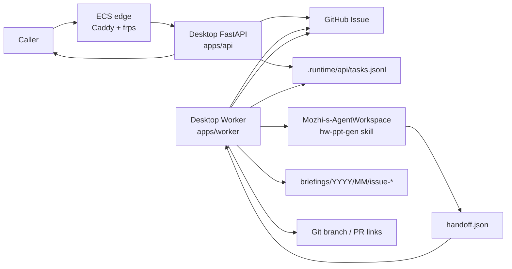
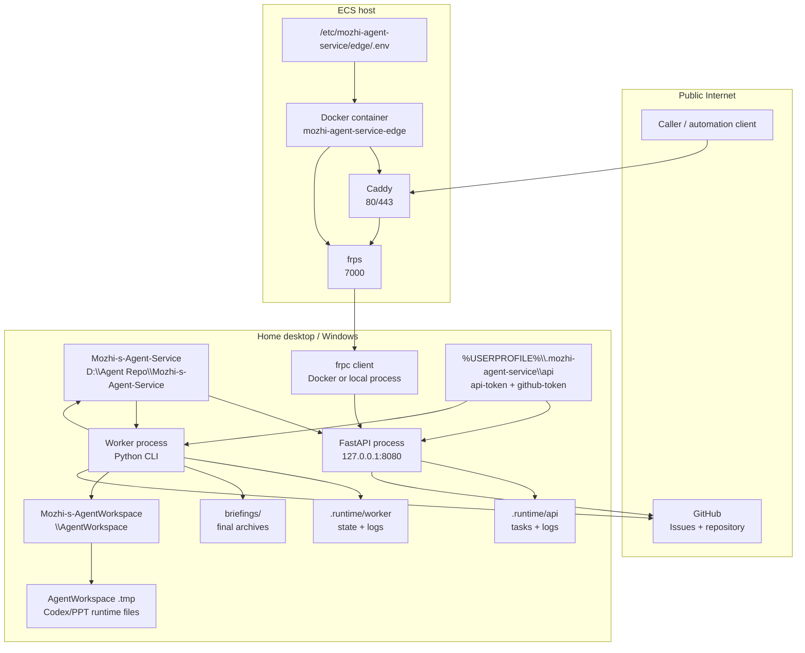
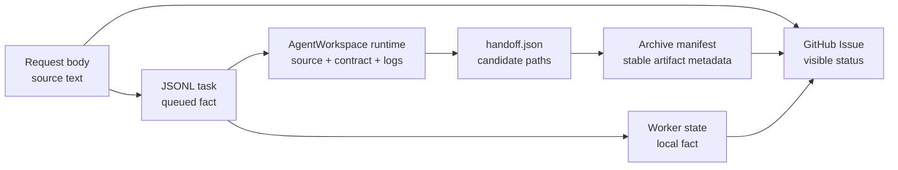

# Mozhi Agent Service Architecture Design

这是 `Mozhi-s-Agent-Service` 的开发期架构文档。它解释这个仓库作为一个系统如何被拆分、部署、运行、验证和归档。

`README.md` 面向仓库定位和日常使用，`docs/requirements/briefing-generation-api.md` 面向需求和 API 契约。本文件面向维护者和编码 Agent：当修改服务代码、Worker 代码、部署拓扑、任务状态、归档格式或仓库约定时，必须先读取并保持一致。

## 架构目标

本仓库把外部提交的资料转化为可追踪、可审计、可归档的 briefing 生成任务。

三个不变量定义系统：

1. HTTP 接入、异步执行、PPT 生成能力、最终归档是独立架构元素。
2. GitHub Issue 是用户可见的状态页，仓库本地状态是 Worker 可恢复执行的事实源。
3. `hw-ppt-gen` 能力属于外部 `Mozhi-s-AgentWorkspace`，本仓库只编排调用、校验交接、归档最终产物。

## 架构原则

架构原则用于回答后续扩展时最重要的三个问题：

- 新能力应该加在远端、API 服务器、Worker，还是外部 AgentWorkspace？
- 一个任务怎样被接收、执行、失败、重试和判定成功？
- 监控应该看什么、允许做什么、绝不能变成什么？

### 1. 组件职责和能力边界

系统按物理运行位置和副作用类型分为四个主要组件：远端 Edge、API 服务器、Worker、外部 AgentWorkspace。

#### 远端 Edge

远端 Edge 指 ECS 上的 `mozhi-agent-service-edge` 容器，包括 Caddy 和 `frps`。

职责：

- 承接公网流量；
- 终止或转发 HTTP/HTTPS；
- 把允许的路径通过 FRP 转发到桌面 API；
- 执行与公网入口相关的通用保护，例如请求体限制、HTTPS 路由、健康检查路由。

能力边界：

- 可以新增路由、TLS、限流、请求体大小、基础访问控制、隧道配置和健康探针。
- 不承载业务状态。
- 不创建 GitHub Issue。
- 不读写任务队列。
- 不运行 Worker。
- 不运行 Codex 或 PPT 生成。
- 不保存 briefing 产物。

未来加能力时：

- 公网入口、安全入口、域名、HTTPS、反向代理、FRP、边缘健康检查，放在远端 Edge。
- 任何需要理解 briefing 业务语义、任务状态或产物归档的能力，不放在远端 Edge。

#### API 服务器

API 服务器指桌面主机上的 FastAPI 进程，代码位于 `apps/api/`。

职责：

- 接收调用者请求；
- 完成认证、请求格式校验、标题解析、正文大小和 UTF-8 校验；
- 创建 GitHub Issue，给调用者一个可见状态页；
- 写入本地任务队列；
- 提供本地 Monitor 页面和健康检查。

能力边界：

- 可以新增同步、快速、确定性的请求接入能力。
- 可以新增 API 级校验、幂等键、请求去重、任务查询入口和本地 Monitor 读接口。
- 不运行长任务。
- 不调用 Codex。
- 不生成 PPT。
- 不做最终归档。
- 不发布 Git 分支。

未来加能力时：

- 和“接收请求前后几秒内能完成”的能力，优先放 API。
- 需要等待外部工具、生成文件、跑 QA、推 Git、重试恢复的能力，放 Worker。

#### Worker

Worker 指桌面主机上的异步任务执行进程，代码位于 `apps/worker/`。

职责：

- 从任务队列中选择可执行任务；
- claim task 并维护本地 Worker state；
- 推进任务生命周期；
- 更新 GitHub Issue 里程碑；
- 调用外部 AgentWorkspace 生成候选 PPT；
- 校验 handoff；
- 在归档前执行质量门禁；
- 归档最终产物；
- 发布分支并把最终链接写回 Issue。

能力边界：

- 可以新增任务调度、重试、并发控制、失败恢复、归档策略、发布策略和 Issue 更新策略。
- 可以调用外部进程和工具，但必须通过明确契约交接。
- 不拥有 PPT 生成语义。
- 不复制 `hw-ppt-gen` skill。
- 不把运行时 scratch 文件当成最终归档。

未来加能力时：

- 任何跨阶段、长耗时、有副作用、需要恢复或重试的能力，放 Worker。
- 如果能力本质上是 PPT 内容生成、版式生成、PPT QA 规则，放 AgentWorkspace，而不是 Worker。

#### 外部 AgentWorkspace

外部 AgentWorkspace 指 `Mozhi-s-AgentWorkspace` 及其中注册的 PPT skills。

职责：

- 理解资料；
- 研究、规划、生成 briefing deck；
- 执行 PPT skill 内定义的生成和质量检查；
- 产出候选 PPTX、QA 摘要、QA JSON、slides 目录、deck workspace；
- 写出 `handoff.json`。

能力边界：

- 可以新增 PPT 生成能力、资料解析能力、视觉风格规则、QA 规则和 skill runtime 能力。
- 不归档到 `Mozhi-s-Agent-Service`。
- 不发布 Git 分支。
- 不改变本仓库任务队列。
- 不拥有最终任务生命周期。

未来加能力时：

- 和“怎么把资料变成高质量 PPT”相关的能力，放 AgentWorkspace。
- 和“一个服务任务怎么排队、失败、重试、归档、通知”相关的能力，放 Worker。

#### 能力落点决策表

新增能力时，先按下表判断落点。若一个能力跨多个组件，应把入口、编排、生成、归档拆开，不要把整条链路塞进单个组件。

| 新能力类型 | 默认落点 | 原则 |
| --- | --- | --- |
| 公网域名、HTTPS、证书、Caddy 路由 | 远端 Edge | 属于公网入口和反向代理能力。 |
| FRP 服务端配置、隧道端口、Edge 健康探针 | 远端 Edge | 属于远端连通性能力。 |
| 公网请求体限制、基础边缘限流 | 远端 Edge | 属于入口保护，不理解 briefing 业务语义。 |
| API token 校验、请求 body 校验、标题解析 | API 服务器 | 属于快速、确定性的接入校验。 |
| 新请求字段、幂等 key、提交去重入口 | API 服务器 | 属于请求接收契约；跨任务判断可交给 Worker/state。 |
| 创建 GitHub Issue、返回 Issue URL | API 服务器 | 属于接入完成标准，必须在返回 `202` 前完成。 |
| 任务查询 API、本地 Monitor 读接口 | API 服务器 | 属于读取服务状态，不执行长任务。 |
| Worker 启动入口、一次性处理、drain 模式 | Worker / Worker CLI | 属于异步执行控制。 |
| 任务 claim、锁、并发控制、重试、恢复 | Worker | 属于任务生命周期管理。 |
| Issue 阶段更新、失败说明、完成说明 | Worker | 属于任务执行进度和结果发布。 |
| Codex 调用、超时控制、handoff 校验 | Worker | 属于外部生成编排，不属于生成语义。 |
| PPT 内容理解、资料解析、页面规划、风格规则 | AgentWorkspace | 属于生成能力。 |
| PPT 渲染、PPT QA 规则、skill runtime 调整 | AgentWorkspace | 属于 `hw-ppt-gen` 能力边界。 |
| 归档目录生成、manifest、artifact metadata | Worker | 属于最终产物发布契约。 |
| Git 分支发布、PR/链接生成 | Worker | 属于 archive 发布动作。 |
| Monitor 任务列表、stale task、环境 health | API Monitor | 属于本地可观测性。 |
| Monitor 上触发 Worker start | API Monitor 调 Worker CLI | Monitor 只做受限入口，执行逻辑仍在 Worker。 |
| 告警通知、失败摘要推送 | Worker 或 Monitor | 生命周期事件通知放 Worker；健康巡检通知放 Monitor。 |
| Secret 文件位置、加载脚本 | 对应运行组件 | API secret 归 API；Edge secret 归 Edge；不要混放。 |

### 2. 任务生命周期原则

任务生命周期是本服务的业务主线。所有新能力都必须明确它影响生命周期的哪个阶段。

#### 生命周期阶段

```text
accepted -> queued -> claimed -> generating -> generated -> gated -> publishing -> completed
                                      |             |             |
                                      v             v             v
                                    failed       qa_failed      failed
```

阶段含义：

- `accepted`：API 已通过校验，并准备创建 Issue 和写队列。
- `queued`：Issue 已创建，任务已写入本地队列，API 可以返回 `202`。
- `claimed`：Worker 已选中任务，并写入本地 state，避免其他 Worker 重复处理。
- `generating`：Worker 已启动外部 AgentWorkspace/Codex 生成。
- `generated`：外部生成结束，Worker 已拿到并校验 `handoff.json`。
- `gated`：归档前质量门禁已通过。
- `publishing`：Worker 正在写入 `briefings/`、生成 manifest、发布分支或链接。
- `completed`：最终归档、manifest、链接和 Issue 完成更新。
- `qa_failed`：生成成功，但质量门禁不通过。
- `failed`：接入、编排、外部调用、handoff、归档、GitHub、Git 或环境错误导致任务未完成。

#### 成功标准

一个任务只有同时满足以下条件才算成功：

- API 返回过可追踪的 `request_id` 和 GitHub Issue URL；
- Worker state 进入 `completed`；
- GitHub Issue 有最终完成说明；
- `briefings/YYYY/MM/issue-<number>-<slug>/` 存在；
- 归档目录至少包含 `source.md`、`brief.pptx`、`qa-summary.md`、`manifest.json`；
- `manifest.json` 能描述所有最终 artifact 的 logical path、storage backend、hash、size 和 download URL；
- 最终链接可以让调用者找到归档产物。

没有最终 archive 和 manifest 的任务不能标记为 `completed`。

#### 失败原则

失败要分为可恢复失败和终止失败，但两者都必须可解释。

- API 创建 Issue 失败：请求失败，不能入队。
- API 创建 Issue 成功但入队失败：必须把 Issue 标记为失败，避免悬空任务。
- Worker claim 前失败：任务保持 queued，可由后续 Worker 处理。
- Worker claim 后失败：必须写 Worker state，并尽力更新 Issue。
- 外部生成失败：进入 `failed`，保留 runtime log 路径供本地排查。
- handoff 缺失或无效：进入 `failed`，因为 Worker 无法证明候选产物存在。
- 质量门禁失败：进入 `qa_failed`，不能归档为 completed。
- 发布或归档失败：进入 `failed`，不能只在 Issue 上贴候选 PPT 链接冒充成功。

失败记录必须包含：

- 失败阶段；
- 失败原因；
- 是否建议重试；
- 操作员下一步应检查的位置，例如 Worker state、runtime dir、日志、Issue 或 Git 状态。

#### 重试原则

重试是 Worker 能力，不是 API 能力。

- 重试同一 request 时，应复用原 Issue 和 request id。
- 重试前必须读取 Worker state，判断是否已经 terminal。
- 对 `completed` 任务默认不重跑，除非操作员显式要求重新生成新版本。
- 对 `qa_failed` 任务可以重跑生成或从修复后的候选产物重新过门禁，但必须留下新的 Issue 说明。
- 对 `failed` 任务可以从失败阶段附近恢复；如果无法安全恢复，则从生成阶段重新开始。
- 重试不得删除已有最终 archive，除非操作员明确要求替换，并且 manifest/Issue 要能解释新旧关系。

#### 生命周期扩展原则

新增生命周期能力时：

- 新状态必须能映射到 API 响应、Worker state、Issue 文案和 Monitor 展示；
- 新状态必须说明是否 terminal；
- 新状态必须说明是否可重试；
- 新状态不能只存在于日志里；
- 不要为很短的内部步骤新增公共状态，除非操作员需要据此行动。

### 3. 监控原则

监控用于让操作员理解系统是否健康、任务卡在哪里、下一步该查什么。监控不是公网产品界面，也不是主控制面。

#### 监控范围

Monitor 应覆盖三类信息：

- 入口健康：桌面 API、ECS Edge、FRP 隧道、`/health`。
- 任务健康：queued、in-progress、completed、failed、qa_failed、stale tasks。
- 环境健康：任务队列、Worker state、AgentWorkspace、briefings archive、Git LFS、日志路径、必要 secret 是否可用。

#### 监控边界

Monitor 可以：

- 读取本地任务队列；
- 读取 Worker state；
- 读取 archive manifest；
- 检查本地 API/Worker/FRP/ECS health；
- 展示最近任务和失败原因；
- 在 loopback-only 页面触发本地 Worker start。

Monitor 不应：

- 直接修改任务队列；
- 直接编辑 Worker state；
- 直接改 GitHub Issue；
- 直接写 archive；
- 暴露到公网；
- 成为替代 Worker 的任务执行系统。

#### 告警和可行动性原则

监控项必须可行动：

- 显示失败时，要说明操作员下一步该看哪个文件、日志、进程或远端服务。
- 显示 stale task 时，要说明卡住阶段和最后更新时间。
- 显示环境缺失时，要说明缺的是 API secret、GitHub token、AgentWorkspace、Git LFS、FRP 还是 ECS Edge。
- 不能只有红绿灯；需要能定位到生命周期阶段或物理组件。

#### 监控扩展原则

未来新增监控能力时：

- 如果它观察的是公网入口或隧道，挂到 Edge/FRP health。
- 如果它观察的是任务状态，挂到生命周期视图。
- 如果它观察的是运行环境，挂到环境 health。
- 如果它会改变任务状态，应放到 Worker CLI/API，并由 Monitor 调用受限入口，而不是把业务逻辑写进 Monitor。

## 逻辑架构视图

逻辑视图只列稳定责任边界。运行关系放在运行视图，部署关系放在物理视图。

这个服务仓库不需要按技术步骤拆成很多层。它的核心架构只有四个责任块：接入、编排、外部生成、归档发布。GitHub Issue、任务状态、监控和 QA 都是这些责任块中的契约或约束，不单独成为顶层逻辑层。

```text
+--------------------------------------------------------------------------------+
| Public Access / 接入边界                                                        |
|                                                                                |
|   +-------------------------+   +-------------------------+   +--------------+  |
|   | POST /api/briefings     |   | GitHub Issue            |   | /health      |  |
|   | async request contract  |   | caller-visible status   |   | edge health  |  |
|   +-------------------------+   +-------------------------+   +--------------+  |
+--------------------------------------------------------------------------------+

+--------------------------------------------------------------------------------+
| Task Orchestration / 任务编排边界                                                |
|                                                                                |
|   +-------------------------+   +-------------------------+   +--------------+  |
|   | JSONL queue             |   | Worker state            |   | Issue update |  |
|   | accepted tasks          |   | recoverable execution   |   | progress log |  |
|   +-------------------------+   +-------------------------+   +--------------+  |
+--------------------------------------------------------------------------------+

+--------------------------------------------------------------------------------+
| External Generation / 外部生成边界                                                |
|                                                                                |
|   +-------------------------+   +-------------------------+   +--------------+  |
|   | CodexRunner             |   | AgentWorkspace .tmp     |   | handoff.json |  |
|   | constrained invocation  |   | runtime workspace       |   | handoff file |  |
|   +-------------------------+   +-------------------------+   +--------------+  |
+--------------------------------------------------------------------------------+

+--------------------------------------------------------------------------------+
| Archive And Publication / 归档发布边界                                           |
|                                                                                |
|   +-------------------------+   +-------------------------+   +--------------+  |
|   | briefings/ archive      |   | manifest.json           |   | Git branch   |  |
|   | final curated outputs   |   | storage map             |   | share links  |  |
|   +-------------------------+   +-------------------------+   +--------------+  |
+--------------------------------------------------------------------------------+
```

依赖方向：

- 接入边界只依赖稳定 API、Issue 和健康检查语义，不暴露 Worker 或 PPT 生成内部细节。
- 任务编排边界可以读取任务、推进状态、更新 Issue、调用外部生成，但不能把外部 skill 实现复制进本仓库。
- 外部生成边界只能通过明确的输入文件、运行目录、状态脚本和 `handoff.json` 与 Worker 交接。
- 归档发布边界只接收最终候选产物，不归档运行时 scratch 文件。
- 物理部署、隧道和本地监控属于物理架构视图，不作为逻辑层拆分。

## 运行视图

主流程必须保持异步：HTTP 请求只完成接入、建 Issue、入队，然后立即返回。



运行约束：

- `POST /api/briefings` 必须快速返回 `202 Accepted`，不能同步运行 Codex 或 PPT 生成。
- API 创建 Issue 成功但任务入队失败时，必须把 Issue 标记为失败，避免用户看到永远不执行的任务。
- Worker 状态推进必须同时写入本地 state，并尽力更新 GitHub Issue；Issue 更新失败不能抹掉本地事实。
- Codex 运行目录属于 `Mozhi-s-AgentWorkspace/.tmp/mozhi-service/<request_id>/`，不是本仓库归档目录。
- 外部生成只能通过 `handoff.json` 回传候选 PPTX、QA 摘要、QA JSON、slides 目录和 deck workspace。
- 只有 Worker 可以把最终产物复制进 `briefings/` 并发布 Git 分支。

## 物理架构视图

物理视图描述进程、主机、仓库和数据位置。它是独立视图，不替代逻辑分层或运行流。



物理边界：

- ECS 只承载边缘网关：Caddy、`frps`、TLS/HTTP 路由和请求体限制。
- ECS 镜像不得包含 FastAPI 业务代码、Worker、Codex、PPT 生成能力、真实生成产物或 briefing archives。
- 桌面主机承载业务执行：API、Worker、Codex CLI、`Mozhi-s-AgentWorkspace`、本地任务状态和最终归档。
- 本仓库 `.runtime/` 保存服务运行态文件，必须被视为本地持久状态，不提交。
- 本仓库 `.tmp/` 只保存可删除 scratch，例如本地验证输出和测试临时文件。
- `%USERPROFILE%\.mozhi-agent-service\api\` 只保存 secret，不保存日志、任务队列、测试输出或 scratch 产物。
- 每个 Service clone 默认使用其下的 `AgentWorkspace/` 子仓；`AgentWorkspace/.tmp/` 保存生成过程文件；本仓库只接收最终 curated artifacts。
- GitHub 是外部可见状态与代码归档平台，不是 Worker 的唯一恢复事实源。

## 架构元素

### API Contract

Owned by:

- `docs/requirements/briefing-generation-api.md`
- `apps/api/mozhi_api/main.py`
- `apps/api/tests/*`

Responsibility:

- 定义 `POST /api/briefings` 的认证、标题、正文、错误码和响应形态；
- 创建调用者可见的 GitHub Issue；
- 把任务持久化到本地 JSONL 队列；
- 提供 `/health` 给边缘网关验证。

Constraints:

- API 不得运行 Codex、调用 PPT skill、做 QA、归档 PPTX 或 push Git。
- API 的成功响应只能表示任务已排队，不表示生成已完成。
- 新增请求字段或错误码时，需求文档、实现和测试必须一起更新。

### GitHub Issue Lifecycle

Owned by:

- `apps/api/mozhi_api/main.py`
- `apps/worker/mozhi_worker/issue.py`
- `docs/requirements/briefing-generation-api.md`

Responsibility:

- 作为用户可见的任务状态页；
- 记录 request id、阶段、失败原因、QA 摘要和最终归档链接；
- 用 `agent-briefing` label 区分服务创建的 Issue。

Constraints:

- Issue 是可见状态页，不是唯一任务数据库。
- 每个 Worker 关键阶段应有可读的 Issue 里程碑更新。
- Issue 更新失败应记录到 Worker state，不能伪装为阶段成功。
- Issue 文本不得暴露 secret、完整 runtime scratch 路径中的敏感材料或未筛选中间产物。

### Task Store And Worker State

Owned by:

- `.runtime/api/tasks.jsonl`
- `.runtime/worker/state/*.json`
- `apps/worker/mozhi_worker/task_store.py`
- `apps/worker/mozhi_worker/state.py`

Responsibility:

- 保存 API 已接收且待 Worker 处理的任务；
- 保存 Worker 对每个 request 的本地阶段事实；
- 支持手动重跑、监控和故障排查。

Constraints:

- JSONL 队列和 Worker state 属于运行态文件，不提交。
- Worker 选择任务时必须跳过 terminal 或 in-progress 状态，避免重复处理。
- 状态值应保持小而稳定；新增状态必须同步更新监控、Issue 更新和文档。

### Worker Orchestrator

Owned by:

- `apps/worker/mozhi_worker/worker.py`
- `apps/worker/mozhi_worker/cli.py`
- `scripts/worker/start-desktop-worker.ps1`

Responsibility:

- claim task；
- 推进状态；
- 调用 Codex；
- 运行 QA；
- 归档产物；
- 发布分支并完成 Issue。

Constraints:

- Worker 可以编排副作用，但每类副作用要保持在可测试的小模块中。
- Worker 不应把长时间 AI 循环埋进 API 进程。
- Worker 捕获失败时必须给出可恢复线索：失败阶段、原因、重试建议。

### External Generation Boundary

Owned by:

- `apps/worker/mozhi_worker/codex_runner.py`
- `Mozhi-s-AgentWorkspace`
- `Mozhi-s-AgentWorkspace` 内注册的 PPT skill

Responsibility:

- 把 source、worker contract、status script 和 runtime dir 交给外部 AgentWorkspace；
- 约束 Codex 在 AgentWorkspace 中运行；
- 通过 `handoff.json` 取回机器可读的候选产物信息。

Constraints:

- 本仓库不得复制、改写或内联 `hw-ppt-gen` skill 实现。
- Codex 生成过程不得修改、归档或 push `Mozhi-s-Agent-Service`。
- 外部 Agent 可以通过 status script 更新 Issue 进度，但最终归档和发布由 Worker 完成。
- `handoff.json` 缺字段、路径不存在或 QA 摘要不可解析时，Worker 必须失败。

### Archive And Manifest

Owned by:

- `briefings/YYYY/MM/issue-<number>-<slug>/`
- `apps/worker/mozhi_worker/archive.py`
- `.gitattributes`

Responsibility:

- 保存最终 curated artifacts；
- 固化 source snapshot、PPTX、QA summary 和 manifest；
- 提供可迁移的 storage metadata。

Constraints:

- 归档目录只保存最终产物：`source.md`、`brief.pptx`、`qa-summary.md`、`manifest.json`。
- 不归档 Codex stdout/stderr、deck workspace、slide PNG scratch set、临时脚本或 `.tmp/` workspace，除非被明确选为最终 QA 证据。
- `manifest.json` 是归档契约，必须包含 artifact id、kind、logical path、storage backend、hash、size 和 download URL。
- PPTX 可由 Git LFS 承载，但业务契约必须依赖 manifest，而不是依赖 Git LFS 本身。
- Worker 可以在归档前执行质量门禁；质量门禁失败时不能发布 completed archive。

### Edge Gateway

Owned by:

- `deploy/ecs/agent-service-edge/*`
- `scripts/ecs/*`
- `docs/operations/agent-service-edge-image.md`

Responsibility:

- 在 ECS 上提供公网入口；
- 通过 Caddy 处理 HTTP/HTTPS 和路由；
- 通过 FRP 把请求转发到桌面 API；
- 保护 `/api/*` 的公网暴露边界和请求体限制。

Constraints:

- Edge 镜像不得包含业务服务、Worker、Codex、PPT 生成逻辑或归档产物。
- 公网 HTTP-by-IP 验证应限制在 `/health`，`/api/*` 应走 HTTPS 或显式短期验证路径。
- Edge 配置变化必须同步更新运维文档和本地验证脚本。

### Local Monitor

Owned by:

- `apps/api/mozhi_api/monitor.py`
- `docs/operations/monitoring-dashboard.md`

Responsibility:

- 为桌面操作员提供只读监控；
- 汇总本地任务、Worker state、归档、Git LFS、FRP/ECS 健康；
- 提供本地-only Worker start 控制。

Constraints:

- `/monitor` 和 `/api/monitor/*` 必须保持 loopback-only。
- Monitor 不能成为公网控制面。
- Monitor 可以读取本地文件和启动本地 Worker，但不得直接修改 GitHub Issue、归档文件或任务状态。
- 如果未来需要远程 Monitor，必须新增明确认证边界，而不是复用现有公网 API token 暴露本地页面。

## 核心数据流



数据边界：

- Source text 可以进入 Issue preview、任务队列、AgentWorkspace runtime 和最终 `source.md`。
- Secret 只能通过环境变量或 secret 文件进入进程，不得进入 Issue、manifest、archive 或 logs。
- Runtime logs 留在 `.runtime/`，AgentWorkspace generation scratch 留在
  AgentWorkspace `.tmp/`，两者都不进入最终 archive。
- Manifest 是最终 artifact 的可迁移索引，不是运行日志。

## 状态模型

服务级状态应保持可读、可恢复、可映射到 Issue。

架构原则中的生命周期阶段是概念模型；代码中的状态名可以更贴近当前实现，但必须能映射回概念模型。

概念生命周期：

```text
accepted -> queued -> claimed -> generating -> generated -> gated -> publishing -> completed
                                      |             |             |
                                      v             v             v
                                    failed       qa_failed      failed
```

当前实现状态：

| 实现状态 | 概念阶段 | 说明 |
| --- | --- | --- |
| `queued` | `queued` | API 已创建 Issue 并写入任务队列。 |
| `running` | `claimed` | Worker 已认领任务。 |
| `generating` | `generating` | Worker 已启动外部生成。 |
| `generation_completed` | `generated` | Worker 已拿到并记录 handoff。 |
| `qa_passed` | `gated` | 归档前质量门禁已通过。 |
| `publishing` | `publishing` | Worker 正在归档和发布。 |
| `completed` | `completed` | 归档、manifest、链接和 Issue 已完成。 |
| `qa_failed` | `qa_failed` | 生成完成但质量门禁失败。 |
| `failed` | `failed` | 接入、编排、外部调用、handoff、归档、GitHub、Git 或环境错误。 |

状态约束：

- `queued` 由 API 写入。
- `running` 及之后由 Worker 写入。
- `completed`、`qa_failed`、`failed` 是 terminal 状态。
- 新增实现状态必须能映射到概念生命周期。
- 新增状态必须在 Worker state、Issue 文案、Monitor 分类和测试中一起出现。

## 一致性契约

本仓库有六个必须保持一致的表面：

1. 需求文档：`docs/requirements/briefing-generation-api.md`
2. 架构文档：`docs/architecture-design.md`
3. API 实现和测试：`apps/api/*`
4. Worker 实现和测试：`apps/worker/*`
5. 运维部署文档和脚本：`deploy/*`、`scripts/*`、`docs/operations/*`
6. 最终归档契约：`briefings/*/manifest.json`

修改行为时：

- 先判断变化属于 API、Worker、外部生成、归档、Edge、Monitor 哪个架构元素；
- 更新拥有该行为的实现；
- 更新可以观察或验证该行为的测试、脚本或监控；
- 更新对应文档；
- 不要只让代码“能跑”，却留下 Issue 状态、manifest、monitor 或 AGENTS 约束与代码不一致。

## 常见架构漂移模式

需要主动避免：

- 同步化漂移：为了方便调试，把 PPT 生成塞回 HTTP 请求路径。
- 能力内联漂移：把 `hw-ppt-gen` skill 的生成逻辑复制到本仓库。
- 归档膨胀漂移：把 runtime workspace、logs、PNG scratch、临时脚本作为默认归档内容提交。
- Issue 数据库漂移：只依赖 Issue 文本判断任务事实，忽略本地 state。
- Monitor 控制面漂移：把本地监控页面或 Worker 控制公开到 ECS。
- Edge 职责漂移：在 ECS 镜像里加入业务 Worker、Codex 或生成产物。
- Manifest 弱化漂移：只给 PPTX 链接，不保存 hash、size、backend 和 logical path。
- QA 绕过漂移：QA 失败后仍归档或发布 completed。
- 状态词发散漂移：API、Worker、Issue、Monitor 对同一阶段使用不同状态名。
- Secret 混放漂移：把 token、`.env`、GitHub credentials、runtime logs 混入仓库或 archive。

## 架构敏感变更清单

合并架构敏感变更前，检查：

- 变化是否仍保持 API 接入、异步 Worker、外部 PPT 能力、最终归档分离；
- `POST /api/briefings` 是否仍快速返回 `202`；
- GitHub Issue 是否仍是用户可见状态页；
- 本地 state 是否仍是 Worker 可恢复执行事实源；
- Codex 是否仍在 `Mozhi-s-AgentWorkspace` 中运行；
- `hw-ppt-gen` skill 是否仍没有被复制或重写进本仓库；
- QA 失败是否会阻止归档和 completed；
- archive 是否只包含最终 curated artifacts；
- manifest 是否足够支持未来从 Git LFS 迁移到对象存储；
- ECS edge 是否仍只承担 Caddy/FRP 网关职责；
- Monitor 是否仍保持 loopback-only；
- secret、runtime scratch、logs 是否没有进入 Git；
- 需求文档、架构文档、实现、测试、运维文档和 `AGENTS.md` 是否一致。
