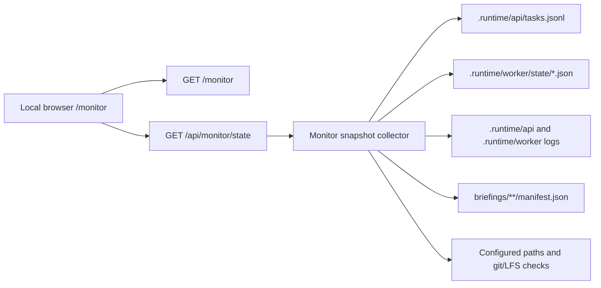

# Local Monitoring Dashboard Plan

## Problem Frame

The briefing generation service now has a public request API and a desktop worker
that moves tasks through generation, QA, archive, and publish stages. Operators
need a local monitoring page that shows whether the system is healthy, which
tasks are queued or running, how recent jobs ended, and where completed
artifacts live.

The monitor must stay outside the public product contract. It observes
Service-owned state and artifacts, but it must not become a custom delivery UI,
worker control plane, or replacement for GitHub Issues.

---

## Requirements Trace

- R1. Provide a browser page for local operators to inspect current system state.
- R2. Show task-level status from queued task records and worker state files.
- R3. Show system-level health checks for the local service environment.
- R4. Include historical summary statistics for completed, failed, QA-failed,
  queued, and in-progress jobs.
- R5. Detect likely stuck in-progress tasks with rule-based thresholds.
- R6. Keep the monitor read-only: no retries, cancellations, Issue comments,
  Git operations, archive changes, or worker state mutations.
- R7. Keep the monitor local-only and unavailable through the public ECS edge.
- R8. Poll status from the page every 5 seconds using a JSON endpoint.

---

## Scope Boundaries

- Do not add a database, metrics backend, or background sampler in the first
  version.
- Do not expose the monitoring page through the public API gateway.
- Do not call GitHub APIs from the monitoring endpoint; use already recorded
  task and archive metadata.
- Do not read or display full request bodies beyond safe previews already
  needed for operations.
- Do not inspect AgentWorkspace scratch files recursively; only verify the
  configured workspace path and task runtime paths recorded by the worker.
- Do not add write actions such as retry, cancel, publish, or resolve Issue.

### Deferred to Follow-Up Work

- Authentication beyond local-only access: future iteration if remote monitoring
  is needed.
- WebSocket or Server-Sent Events streaming: future iteration if 5-second polling
  becomes insufficient.
- Durable metrics store and trend charts across long retention windows: future
  iteration after the worker lifecycle stabilizes.
- Failure clustering across logs and Issues: future iteration once real failure
  volume exists.

---

## Context & Research

### Relevant Code and Patterns

- `apps/api/mozhi_api/main.py` owns the existing FastAPI app, settings, health
  endpoint, request validation, and JSON task-store write path.
- `apps/api/tests/test_briefings_api.py` shows the current TestClient pattern for
  API behavior and injected settings.
- `apps/worker/mozhi_worker/config.py` defines default task store, worker state,
  log, AgentWorkspace, repository, and branch settings.
- `apps/worker/mozhi_worker/task_store.py` reads queued tasks from JSONL.
- `apps/worker/mozhi_worker/state.py` reads and writes per-request worker state
files under `.runtime/worker/state`.
- `apps/worker/mozhi_worker/models.py` defines terminal and in-progress status
  groups.
- `apps/worker/mozhi_worker/worker.py` records the status transitions the monitor
  should understand: `running`, `generating`, `generation_completed`,
  `qa_passed`, `publishing`, `completed`, `qa_failed`, and `failed`.
- `apps/worker/tests/test_worker_atomics.py` provides fixture patterns for fake
  tasks, fake state, archive metadata, and status assertions.
- `docs/requirements/implementation-plan/03-worker-codex-cli.md`,
  `docs/requirements/implementation-plan/04-ppt-qa-failure-feedback.md`, and
  `docs/requirements/implementation-plan/05-archive-issue-delivery.md` define
  the worker lifecycle, QA gate, and final archive contract.

### Institutional Learnings

- No `docs/solutions/` directory exists yet, so there are no local learning
  notes to carry forward.

### External References

- None used. The repo already uses FastAPI and local JSON/JSONL state patterns;
  current local conventions are sufficient for this first version.

---

## Key Technical Decisions

- Implement the monitor inside the existing FastAPI app: this minimizes
  deployment moving parts and reuses the desktop API process.
- Add `GET /monitor` for the HTML page and `GET /api/monitor/state` for the
  polling payload: this separates presentation from state collection while
  keeping the frontend simple.
- Enforce local-only access at the API layer: accept loopback clients and reject
  non-local clients for both monitor routes.
- Keep the page as server-owned static HTML/CSS/JavaScript: no separate React or
  Vite build in the first version.
- Build the state model from existing files: merge `.runtime/api/tasks.jsonl` with
`.runtime/worker/state/*.json`, then derive system health and statistics from that
  read-only snapshot.
- Treat `.runtime/worker/state/*.json` as authoritative for post-claim progress, and
  task JSONL records as authoritative for queued tasks and request metadata.
- Detect stuck tasks by rule: any in-progress task whose `updated_at` is older
  than a configurable threshold defaults to warning after 30 minutes.
- Redact or truncate source text in monitor output to avoid exposing large or
  sensitive request bodies in an operations page.

---

## Open Questions

### Resolved During Planning

- UI shape: FastAPI built-in HTML page.
- Access boundary: local-only, not public Bearer-token access.
- Monitoring depth: task-level status plus system-level health checks.
- Refresh behavior: page polls the JSON status endpoint every 5 seconds.
- Delivery mode: write a technical plan before implementation.

### Deferred to Implementation

- Exact local-client detection behavior behind reverse proxies: implementation
  should reject non-loopback clients by default and only trust forwarded headers
  if a future deployment explicitly needs them.
- Exact log error patterns: start with conservative keyword checks in API and
  worker logs, then tune after real failures appear.
- Exact UI copy and field ordering: implementation may adjust within the
  required data categories.

---

## Output Structure

    apps/api/
      mozhi_api/
        main.py
        monitor.py
      tests/
        test_briefings_api.py
        test_monitor.py
    docs/
      operations/
        monitoring-dashboard.md

---

## High-Level Technical Design

> This illustrates the intended approach and is directional guidance for review,
> not implementation specification. The implementing agent should treat it as
> context, not code to reproduce.

---

## Implementation Units

- U1. **Monitoring Snapshot Collector**

**Goal:** Add a read-only module that loads task, worker state, archive, log, and
environment health information into one JSON-serializable snapshot.

**Requirements:** R2, R3, R4, R5, R6

**Dependencies:** None

**Files:**
- Create: `apps/api/mozhi_api/monitor.py`
- Test: `apps/api/tests/test_monitor.py`

**Approach:**
- Read the configured task store path from API settings and parse JSONL records
  defensively.
- Read worker state JSON files from the configured worker state directory.
- Merge records by `request_id`, preserving task metadata and allowing worker
  state to override lifecycle fields after claim.
- Compute counts by status, recent 24-hour and 7-day task counts, success rate,
  average completed duration where timestamps allow it, and a list of recent
  terminal jobs.
- Run health checks for task store readability, state directory readability,
  AgentWorkspace existence, `briefings/` existence, Git LFS tracking in
  `.gitattributes`, and recent log error indicators.
- Mark in-progress tasks as stale when their last update exceeds the default
  threshold.

**Patterns to follow:**
- `apps/worker/mozhi_worker/task_store.py` for JSONL task parsing behavior.
- `apps/worker/mozhi_worker/state.py` for state file shape and timestamp naming.
- `apps/worker/mozhi_worker/models.py` for terminal and in-progress status sets.

**Test scenarios:**
- Happy path: queued task plus matching worker state produces one merged task
  with worker status and Issue metadata.
- Happy path: completed state with archive links contributes to completed count,
  success rate, and recent terminal jobs.
- Edge case: malformed JSONL line is reported as a health warning without
  failing the whole monitor endpoint.
- Edge case: missing task store returns zero queued tasks and a degraded health
  check, not a server error.
- Edge case: in-progress state older than 30 minutes is marked stale.
- Error path: unreadable or malformed state file appears in diagnostics while
  other tasks still render.
- Integration: `.gitattributes` containing
  `briefings/**/*.pptx filter=lfs diff=lfs merge=lfs -text` marks Git LFS health
  as passing.

**Verification:**
- A snapshot can be built from only local files and contains no side effects.

---

- U2. **Local-Only Monitor Routes**

**Goal:** Expose the monitoring page and JSON state endpoint from the existing
FastAPI application, guarded by local-only access.

**Requirements:** R1, R6, R7, R8

**Dependencies:** U1

**Files:**
- Modify: `apps/api/mozhi_api/main.py`
- Create: `apps/api/tests/test_monitor.py`

**Approach:**
- Add `GET /monitor` that returns a static HTML response with embedded CSS and a
  small polling script.
- Add `GET /api/monitor/state` that returns the collector snapshot as JSON.
- Reject requests whose client host is not loopback. Keep the rule explicit and
  conservative.
- Do not require `MOZHI_API_TOKEN` for local-only monitor routes in v1, because
  the selected access boundary is network locality rather than shared API token.
- Keep monitor route failures isolated from `POST /api/briefings` and
  `GET /health`.

**Patterns to follow:**
- `apps/api/mozhi_api/main.py` for route registration and settings injection.
- `apps/api/tests/test_briefings_api.py` for TestClient route coverage.

**Test scenarios:**
- Happy path: local client can load `/monitor` and receives HTML.
- Happy path: local client can load `/api/monitor/state` and receives status,
  health, statistics, and tasks sections.
- Error path: non-loopback client is rejected for both monitor routes.
- Integration: existing `/health` and `POST /api/briefings` tests continue to
  pass without authorization behavior changes.

**Verification:**
- Monitor routes are available on the desktop API process and do not alter task
  or worker state.

---

- U3. **Dashboard Presentation**

**Goal:** Build a compact operational page that makes current task state,
history, and system health scannable.

**Requirements:** R1, R2, R3, R4, R5, R8

**Dependencies:** U2

**Files:**
- Modify: `apps/api/mozhi_api/monitor.py`
- Test: `apps/api/tests/test_monitor.py`

**Approach:**
- Render a first screen with status counts, active task count, success rate, and
  highest-severity health state.
- Show health checks as pass/warn/fail rows with concise diagnostic text.
- Show current tasks first: queued, running, generating, generation completed,
  QA passed, and publishing.
- Show recent terminal tasks below current tasks: completed, QA failed, and
  failed.
- Include Issue links, branch/archive links when present, QA summary path/link
  when present, last update, duration, and stale warnings.
- Poll `/api/monitor/state` every 5 seconds and update the page without a full
  reload.
- Keep the page functional without external assets, CDN dependencies, or a build
  step.

**Patterns to follow:**
- Existing API uses plain FastAPI responses and keeps dependencies light.

**Test scenarios:**
- Happy path: generated HTML includes the polling endpoint and a visible monitor
  root element.
- Happy path: JSON payload fields used by the page remain stable enough for the
  script to render empty, active, and terminal states.
- Edge case: no tasks renders an empty-state message instead of a broken table.
- Edge case: long titles and source previews are truncated in the JSON payload
  and page-friendly fields.

**Verification:**
- Opening `/monitor` locally shows task summary, system health, and auto-refresh
  behavior.

---

- U4. **Operational Documentation**

**Goal:** Document how to open, interpret, and safely expose the monitoring page.

**Requirements:** R3, R6, R7

**Dependencies:** U1, U2, U3

**Files:**
- Create: `docs/operations/monitoring-dashboard.md`
- Modify: `README.md`

**Approach:**
- Document the local URL, expected desktop API host/port, and the fact that the
  monitor is local-only.
- Document data sources and why the monitor is read-only.
- Document common warnings: missing task store, stale task, missing
  AgentWorkspace, missing Git LFS tracking, recent log errors.
- Document that ECS public routing should not expose `/monitor` or
  `/api/monitor/state`.

**Patterns to follow:**
- `docs/operations/secret-material.md` for concise operator documentation style.
- `README.md` for high-level repository role and runtime-file guidance.

**Test scenarios:**
- Test expectation: none -- documentation-only unit.

**Verification:**
- Operators can find the monitor instructions from the README and understand its
  safety boundary.

---

## System-Wide Impact

- **Interaction graph:** The API process gains two read-only endpoints. Worker
  execution, GitHub Issue updates, archive creation, and publish flows remain
  unchanged.
- **Error propagation:** Monitor collector errors should degrade individual
  health checks and diagnostics rather than returning 500 for the whole page.
- **State lifecycle risks:** The monitor reads files while the API or worker may
  be writing them. It should tolerate partial writes and malformed records.
- **API surface parity:** Public request API behavior must not change. The
  monitor endpoint is an operator-only local surface.
- **Integration coverage:** Tests should prove monitor routes coexist with
  existing API routes and do not require worker execution.
- **Unchanged invariants:** Service repo still owns API, worker state, Issue
  lifecycle metadata, and final archives; AgentWorkspace remains external.

---

## Risks & Dependencies

| Risk | Mitigation |
|------|------------|
| Monitor accidentally exposed through ECS edge | Keep local-only API guard and document that edge routing must not forward monitor paths. |
| Partial JSONL or state writes break the dashboard | Parse defensively and surface warnings per file instead of failing the endpoint. |
| Sensitive source material appears in the monitor | Use truncated previews and avoid full body display. |
| Monitor becomes a control plane | Keep v1 read-only and exclude retry/cancel/publish actions. |
| Health checks overfit early logs | Start with conservative diagnostics and keep log checks advisory. |
| Stale detection causes false alarms on long Codex runs | Base stale warnings on `updated_at`, make the threshold configurable later if needed, and label it as a warning. |

---

## Documentation / Operational Notes

- The monitor should be opened from the desktop host running the API, for
  example `http://127.0.0.1:8080/monitor`.
- The ECS edge should remain focused on public `/health` and `/api/briefings`
  traffic.
- The monitor should not require AgentWorkspace to be running; it only checks
  whether the configured path exists and whether recorded runtime paths are
  present.
- Future remote access should prefer a separate monitor token or authenticated
  VPN/tunnel rather than exposing the local page publicly.

---

## Sources & References

- Origin request: user discussion on 2026-05-07 selecting FastAPI built-in page,
  local-only access, task plus system monitoring, 5-second polling, and plan
  before implementation.
- Requirements: `docs/requirements/briefing-generation-api.md`
- Worker generation plan: `docs/requirements/implementation-plan/03-worker-codex-cli.md`
- QA plan: `docs/requirements/implementation-plan/04-ppt-qa-failure-feedback.md`
- Archive plan: `docs/requirements/implementation-plan/05-archive-issue-delivery.md`
- API code: `apps/api/mozhi_api/main.py`
- Worker code: `apps/worker/mozhi_worker/worker.py`
- Worker state: `apps/worker/mozhi_worker/state.py`
- Task store: `apps/worker/mozhi_worker/task_store.py`
- Tests: `apps/api/tests/test_briefings_api.py`, `apps/worker/tests/test_worker_atomics.py`
