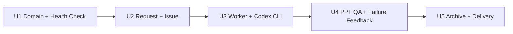

# Briefing Generation API Implementation Plan

This directory breaks `docs/requirements/briefing-generation-api.md` into five
externally verifiable iterations.

Each iteration must deliver one observable capability and one human-readable E2E
acceptance scenario. The plan is intentionally documentation-only: it does not
implement API routes, worker code, deployment scripts, or GitHub automation.

## Goals

- Make the service reachable through a Tencent Cloud domain.
- Accept briefing generation requests and return a GitHub Issue status page.
- Run generation asynchronously through Codex CLI and the external
  `Mozhi-s-AgentWorkspace` repository.
- Keep requesters informed through milestone Issue updates.
- Archive only final curated deliverables in this repository.

## Key Decisions

- The service runs on the user's home desktop machine, not on a purchased cloud
  server.
- The Tencent Cloud domain points directly to the home broadband public IP with
  a DNS A record.
- Tencent Cloud DNS API based DDNS keeps the A record current when the home
  broadband IP changes.
- GitHub Issues are the external status page for all requests.
- Issue updates use milestone-level comments rather than fine-grained runtime
  logs.
- Codex CLI calls `Mozhi-s-AgentWorkspace` as an external dependency.
- This repository must not copy or rewrite the `hw-ppt-gen` skill.
- Final archived artifacts belong under `briefings/`.
- Codex, PPT generation, and skill runtime scratch files must not be committed.

## Iteration Order

1. [Public Domain Access and Health Check](01-public-domain-healthcheck.md)
2. [Briefing Request API and GitHub Issue](02-briefing-request-issue.md)
3. [Async Worker and Codex CLI Execution](03-worker-codex-cli.md)
4. [PPT QA and Failure Feedback](04-ppt-qa-failure-feedback.md)
5. [Final Archive and Issue Delivery](05-archive-issue-delivery.md)

## Dependency Graph



## Shared Interfaces

### HTTP

- `GET /health`
- `POST /api/briefings`

### GitHub Issue States

- `queued`
- `running`
- `qa_failed`
- `completed`
- `failed`

Worker comments may additionally mention milestone stages such as `generating`,
`qa`, and `archive`, but those do not need to become separate persisted status
values unless implementation later needs them.

### Archive Layout

```text
briefings/
  YYYY/
    MM/
      issue-<number>-<slug>/
        source.md
        brief.pptx
        manifest.json
        qa-summary.md
```

## Shared Assumptions

- The home desktop can stay online while the service is expected to work.
- The home broadband connection has an inbound-reachable public IPv4 address.
- The router can forward inbound traffic to the desktop.
- Windows Firewall can be configured to allow the selected service port.
- The domain can be managed through Tencent Cloud DNS.
- Codex CLI can run on the desktop and access `D:\Agent Repo\Mozhi-s-AgentWorkspace`.
- The implementation may choose concrete frameworks and storage later, but must
  preserve the external behavior described in these iteration files.

